# Architecture Diagrams - E-Commerce Platform

## 1. Technical Architecture (For Developers)


### Technical Components:

1. **Frontend Layer**: Web browsers and mobile devices
2. **Security**: SSL/TLS (Let's Encrypt), Firewall rules (ports 80/443)
3. **Web Server**: Nginx with HTTP/2, HSTS headers
4. **Application**: PHP 8.2 + Symfony 5.4 in Docker container
5. **Database**: MySQL 8.0 with persistent storage
6. **Orchestration**: Kubernetes (Minikube) with 3 pods
7. **Authentication**: 2FA with QR code generation (TOTP)
8. **DNS**: DuckDNS with automatic IP updates
9. **Production**: AWS CloudFormation template available (EC2, RDS, S3, CloudFront)

---

## 2. Functional Architecture (For Clients/Business)

```mermaid
graph TB
    subgraph "Users"
        Customer[Customer<br/>👤 Public User]
        Admin[Administrator<br/>👨‍💼 Admin User]
    end

    subgraph "Public Features"
        Home[🏠 Homepage<br/>Product Catalog]
        ProductView[📦 Product Details<br/>Images, Price, Description]
        Cart[🛒 Shopping Cart<br/>Add/Remove Items]
        Search[🔍 Search Products<br/>By Name/Category]
    end

    subgraph "Authentication & Security"
        Login[🔐 Login System<br/>Username + Password]
        TwoFA[📱 Two-Factor Auth<br/>Google Authenticator]
        Register[📝 Registration<br/>Create Account]
        PasswordPolicy[🔒 Password Policy<br/>Min 8 chars, complexity]
    end

    subgraph "Order Management"
        Checkout[💳 Checkout Process<br/>Order Summary]
        OrderHistory[📋 Order History<br/>Track My Orders]
        Payment[💰 Payment Processing<br/>Payment Gateway]
    end

    subgraph "Product Management (Admin)"
        AddProduct[➕ Add Product<br/>Name, Price, Stock]
        EditProduct[✏️ Edit Product<br/>Update Details]
        DeleteProduct[🗑️ Delete Product<br/>Remove from Catalog]
        ManageStock[📊 Stock Management<br/>Inventory Control]
    end

    subgraph "Category Management (Admin)"
        AddCategory[➕ Add Category<br/>Create New Category]
        EditCategory[✏️ Edit Category<br/>Modify Category]
        DeleteCategory[🗑️ Delete Category<br/>Remove Category]
    end

    subgraph "User Management (Admin)"
        ViewUsers[👥 View Users<br/>User List]
        ManageRoles[👑 Manage Roles<br/>Admin/Customer]
        UserActivity[📈 User Activity<br/>Login History]
    end

    subgraph "Reports & Analytics (Admin)"
        Sales[📊 Sales Reports<br/>Revenue Analytics]
        PopularProducts[⭐ Popular Products<br/>Best Sellers]
        Dashboard[📺 Admin Dashboard<br/>Overview]
    end

    subgraph "Data Storage"
        Database[(🗄️ Secure Database<br/>Encrypted Data)]
        Backups[💾 Automatic Backups<br/>Daily Snapshots]
    end

    %% Customer Flow
    Customer --> Home
    Customer --> Search
    Customer --> Register
    Home --> ProductView
    ProductView --> Cart
    Cart --> Login
    Login --> TwoFA
    TwoFA --> Checkout
    Checkout --> Payment
    Payment --> OrderHistory
    
    %% Admin Flow
    Admin --> Login
    Login --> TwoFA
    TwoFA --> Dashboard
    Dashboard --> AddProduct
    Dashboard --> EditProduct
    Dashboard --> DeleteProduct
    Dashboard --> ManageStock
    Dashboard --> AddCategory
    Dashboard --> EditCategory
    Dashboard --> ViewUsers
    Dashboard --> Sales
    Dashboard --> PopularProducts
    
    %% Data Flow
    AddProduct --> Database
    EditProduct --> Database
    Cart --> Database
    Payment --> Database
    Register --> Database
    Database --> Backups
    
    %% Security
    Login --> PasswordPolicy
    Register --> PasswordPolicy

    style Customer fill:#99ccff
    style Admin fill:#ff9999
    style TwoFA fill:#ffcc99
    style Database fill:#99ff99
    style Payment fill:#ffff99
    style Dashboard fill:#cc99ff
```



### Functional Modules:

#### **For Customers:**
1. **Product Browsing**: View products, search, filter by category
2. **Shopping**: Add to cart, view cart, proceed to checkout
3. **Account Management**: Register, login with 2FA, view order history
4. **Secure Payment**: Process orders with integrated payment gateway

#### **For Administrators:**
1. **Product Management**: Add, edit, delete products and manage stock
2. **Category Management**: Organize products into categories
3. **User Management**: View users, assign roles, monitor activity
4. **Reports**: Sales analytics, popular products, revenue tracking
5. **Dashboard**: Centralized overview of all operations

#### **Security Features:**
- 🔐 Two-Factor Authentication (2FA) with QR code
- 🔒 Strong password policy enforcement
- 🛡️ Firewall protection (ports 80/443)
- 🔐 SSL/TLS encryption for all communications
- 💾 Automatic daily backups

---

## 3. High Availability Architecture (With Load Balancer)


### High Availability Components:

1. **Load Balancer (HAProxy/MetalLB)**:
   - Distributes traffic across multiple pods
   - Round-robin or least-connections algorithm
   - Health checks and automatic failover
   - Supports session persistence (sticky sessions)

2. **Multiple App Pods**:
   - Cluster 1: 2 pods (PHP1A, PHP1B) - Primary cluster
   - Cluster 2: 2 pods (PHP2A, PHP2B) - Failover cluster
   - Horizontal scaling capability
   - Zero-downtime deployments

3. **Database Replication**:
   - Primary MySQL (Cluster 1) - Read/Write
   - Replica MySQL (Cluster 2) - Read-only or failover
   - Asynchronous or synchronous replication
   - Automatic failover with promotion

4. **Shared Storage (NFS)**:
   - Centralized file storage for uploads
   - All pods access same files
   - Prevents data inconsistency
   - Can be replaced with S3/MinIO

5. **Traffic Distribution**:
   - 50% traffic to Cluster 1 (primary)
   - 50% standby on Cluster 2 (failover)
   - Automatic failover if cluster fails
   - Geographic distribution possible

### Load Balancer Configuration:

```yaml
# MetalLB LoadBalancer Service Example
apiVersion: v1
kind: Service
metadata:
  name: ecommerce-lb
  namespace: ecommerce
spec:
  type: LoadBalancer
  selector:
    app: ecommerce-app
  ports:
  - port: 80
    targetPort: 80
    name: http
  - port: 443
    targetPort: 443
    name: https
  sessionAffinity: ClientIP  # Sticky sessions for 2FA
```

### Benefits:
- ✅ **High Availability**: No single point of failure
- ✅ **Scalability**: Easily add more pods
- ✅ **Load Distribution**: Better performance
- ✅ **Disaster Recovery**: Automatic failover
- ✅ **Zero Downtime**: Rolling updates

---

## 4. Deployment Flow (Technical)


---

## 5. Data Flow (Business Process)


---

## How to Use These Diagrams:

### For Developers:
- Use **Diagram 1 (Technical Architecture)** to understand the infrastructure
- Use **Diagram 3 (High Availability Architecture)** for production setup
- Reference **Diagram 4 (Deployment Flow)** for CI/CD processes
- Study the component relationships and data flow

### For Clients/Business:
- Show **Diagram 2 (Functional Architecture)** to explain features
- Use **Diagram 5 (Data Flow)** to demonstrate the purchase process
- Highlight security features (2FA, SSL, backups)
- Use **Diagram 3 (High Availability)** to explain reliability and uptime

### Viewing These Diagrams:
1. **GitHub/GitLab**: Automatically renders Mermaid diagrams
2. **VS Code**: Install "Markdown Preview Mermaid Support" extension
3. **Online**: Copy code to https://mermaid.live/
4. **Documentation**: Use in Confluence, Notion, or technical docs

---

## Quick Reference:

| Diagram | Audience | Purpose |
|---------|----------|---------|
| Technical Architecture | Developers, DevOps | Infrastructure overview, component relationships |
| Functional Architecture | Product Owners, Clients | Business features, user workflows |
| High Availability Architecture | Architects, DevOps | Production setup with load balancing and failover |
| Deployment Flow | DevOps, Developers | Build and deployment process |
| Data Flow | Business Analysts, QA | Transaction process, data movement |

---

**Created**: December 5, 2025  
**Project**: E-Commerce Platform with Symfony 5.4  
**Environment**: Kubernetes (Minikube) / AWS CloudFormation Ready
